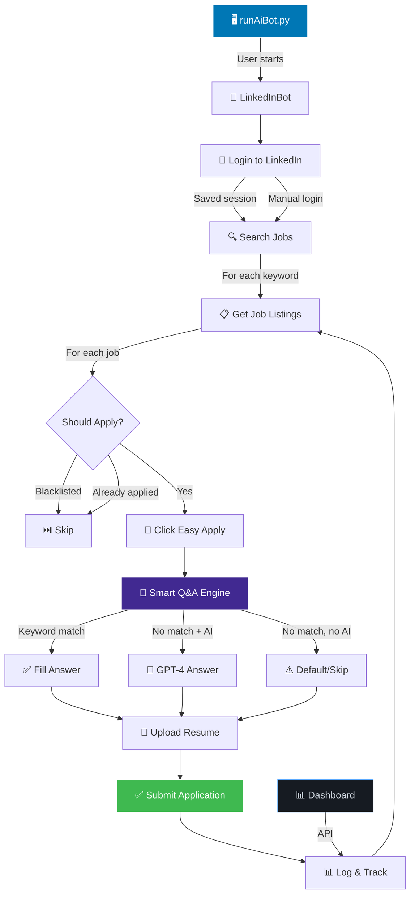
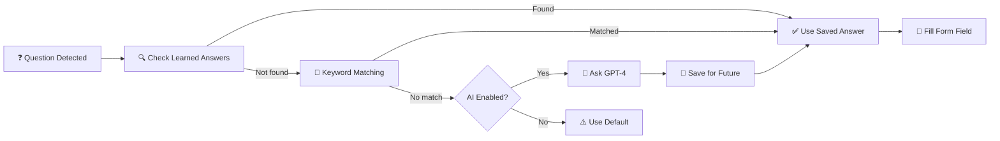

<p align="center">
  
</p>

<h1 align="center">LinkedIn AI Auto Job Applier 🤖</h1>

<p align="center">
  <strong>Automate your LinkedIn Easy Apply job applications with AI-powered smart answers, resume customization, and a built-in analytics dashboard.</strong>
</p>

<p align="center">
  <em>Apply to 50+ jobs per hour while you prepare for interviews. Let AI handle the repetitive clicking.</em>
</p>

<p align="center">
  
  
  
  
  
  <a href="https://github.com/sponsors/RayeesYousufGenAi"></a>
</p>

<p align="center">
  
  
  
</p>

<p align="center">
  <a href="#-see-it-in-action">📽️ Demo</a> •
  <a href="#-content">📋 Index</a> •
  <a href="#-key-features">✨ Features</a> •
  <a href="#%EF%B8%8F-how-to-install">⚙️ Install</a> •
  <a href="#-how-to-configure">🔧 Configure</a> •
  <a href="#-contributor-guidelines">🤝 Contribute</a> •
  <a href="#-sponsors--support">💖 Sponsor</a> •
  <a href="#-community-support-and-discussions">💬 Community</a>
</p>

---

This is a web automation bot that automates the process of job applications on LinkedIn. It searches for jobs relevant to you, answers all questions in the application form using a **smart Q&A engine with 100+ patterns**, customizes your resume based on the collected job information using **OpenAI GPT-4**, and applies to the job — all automatically.

> 💡 **Can apply to 50+ jobs in less than 1 hour.**

---

## 📽️ See it in Action

<!-- [Demo video placeholder — record your bot in action and add the YouTube link here] -->

```
    __    _       __           ____       ___    ____
   / /   (_)___  / /_____  ___/ / /___   /   |  /  _/
  / /   / / __ \/ //_/ _ \/ __  / / _ \ / /| |  / /
 / /___/ / / / / ,< /  __/ /_/ / /  __// ___ |_/ /
/_____/_/_/ /_/_/|_|\___/\__,_/_/\___//_/  |_/___/

  Auto Job Applier v1.0
  ──────────────────────────────────────────────────
  Author: Rayees Yousuf
  GitHub: github.com/RayeesYousufGenAi
  ──────────────────────────────────────────────────

  What would you like to do?

  1. 🚀 Start Auto Applying
  2. 📊 View Application Dashboard
  3. ⚙️  Edit Configuration
  4. ❓ Help
  5. 🚪 Exit

  Enter your choice (1-5): █
```

> 🎥 Record a demo of the bot applying to jobs and replace this section with a YouTube embed!

---

## 📋 Content

- [Introduction](#linkedin-ai-auto-job-applier-)
- [Demo Video](#-see-it-in-action)
- [Index](#-content)
- [Key Features](#-key-features)
- [How to Install](#%EF%B8%8F-how-to-install)
- [How to Configure](#-how-to-configure)
- [Project Architecture](#-project-architecture)
- [Smart Q&A Engine](#-smart-qa-engine)
- [AI Features](#-ai-features-openai-integration)
- [Application Dashboard](#-application-dashboard)
- [Output & Logs](#-output--logs)
- [FAQ & Troubleshooting](#-faq--troubleshooting)
- [Contributor Guidelines](#-contributor-guidelines)
- [Major Updates History](#%EF%B8%8F-major-updates-history)
- [Disclaimer](#-disclaimer)
- [Terms and Conditions](#%EF%B8%8F-terms-and-conditions)
- [License](#%EF%B8%8F-license)
- [Community Support](#-community-support-and-discussions)
- [Author & Socials](#-socials)

---

## ✨ Key Features

### 🧠 Smart Answer Engine (100+ Patterns)
- **Keyword-based Q&A matching** — maps question text to pre-configured answers
- **Intelligent fallbacks** — handles unknown questions with smart defaults
- **AI-powered answers** — uses OpenAI GPT-4 for questions it hasn't seen before
- **Self-learning** — saves new question-answer pairs automatically for future use
- **100+ response patterns** pre-configured out of the box

### 🤖 Automation Capabilities
- **Auto-fill all form fields** — text inputs, dropdowns, radio buttons, checkboxes, textareas
- **Resume auto-upload** — automatically uploads your PDF resume
- **Multi-page form navigation** — clicks Continue/Next/Submit across all steps
- **Human-like typing** — randomized keystroke delays to appear natural
- **Anti-detection (Stealth Mode)** — uses `undetected-chromedriver` to bypass bot detection
- **Persistent Chrome profile** — remembers your LinkedIn login across sessions

### 🤖 AI Integration (OpenAI GPT-4)
- **AI resume customization** — tailors your resume per job description *(coming soon)*
- **AI cover letter generation** — generates unique cover letters *(coming soon)*
- **AI skill extraction** — identifies required skills from job descriptions
- **AI answer generation** — answers unknown screening questions intelligently

### 📊 Built-in Dashboard
- **Web-based UI** — view application history at `http://localhost:5000`
- **Session analytics** — track applied, skipped, and failed applications
- **Company tracking** — see which companies you've applied to
- **Export functionality** — all data saved as JSON for easy analysis

### 🔒 Security & Privacy
- **No credentials in code** — everything in `.gitignored` config file
- **Local execution only** — no data sent to external servers (except OpenAI if enabled)
- **Template config provided** — `secrets.example.py` for safe setup

[back to top](#-content)

---

## ⚙️ How to Install

### Prerequisites

| Requirement | Version | Download |
|------------|---------|----------|
| Python | 3.8+ | [python.org/downloads](https://www.python.org/downloads/) |
| Google Chrome | Latest | [google.com/chrome](https://www.google.com/chrome) |
| Git | Latest | [git-scm.com](https://git-scm.com/) |

### Step-by-Step Installation

**1. Clone the repository:**
```bash
git clone https://github.com/RayeesYousufGenAi/linkedin-ai-auto-applier.git
cd linkedin-ai-auto-applier
```

**2. Install Python dependencies:**
```bash
pip install -r requirements.txt
```
This installs: `undetected-chromedriver`, `selenium`, `pyautogui`, `openai`, `flask`, `colorama`, `pyfiglet`

**3. Set up your configuration:**
```bash
cp config/secrets.example.py config/secrets.py
```

**4. Configure the bot** — fill in your details in the `/config` directory (see [How to Configure](#-how-to-configure))

**5. Add your resume** — place your PDF resume at the path specified in `config/personals.py`

**6. Run the bot!**
```bash
python runAiBot.py
```

> 📌 **First time?** Login to LinkedIn manually in the Chrome window that opens. Your session will be saved for future runs.

> ℹ️ If you have questions or need help, check the [FAQ](#-faq--troubleshooting) or open a [Discussion](https://github.com/RayeesYousufGenAi/linkedin-ai-auto-applier/discussions).

[back to top](#-content)

---

## 🔧 How to Configure

The bot uses 5 configuration files in the `/config` directory:

### 1. `personals.py` — Your Details
```python
first_name = "Your Name"
last_name = "Last Name"
email = "you@email.com"
phone = "+1234567890"
city = "Your City"
years_of_experience = "3"
current_role = "Software Engineer"
default_resume_path = "all resumes/default/resume.pdf"
```

### 2. `secrets.py` — Credentials ⚠️ (gitignored)
```python
linkedin_email = "your-linkedin-email"
linkedin_password = "your-password"
openai_api_key = "sk-..."   # Optional — for AI features
```
> ⚠️ **Never push `secrets.py` to GitHub!** It's already in `.gitignore`.

### 3. `search.py` — Job Search Preferences
```python
search_terms = ["Software Engineer", "AI Engineer", "Data Scientist"]
search_location = "United States"
easy_apply_only = True
max_applications_per_session = 30
date_posted = "Past week"
experience_level = ["Entry level", "Mid-Senior level"]
remote_filter = ["Remote", "Hybrid"]
```

### 4. `questions.py` — Smart Q&A Answers
```python
answers = {
    "authorized": "Yes",
    "sponsorship": "No",
    "relocate": "Yes",
    "years of experience": "3",
    "salary": "80000",
    "start date": "Immediately",
    "python": "Yes",
    # ... 100+ more patterns
}

# AI will answer any questions not matched above
use_ai_for_unknown_questions = True
```

### 5. `settings.py` — Bot Behavior
```python
stealth_mode = True           # Avoid bot detection
run_in_background = False     # See what the bot is doing
min_click_delay = 0.5         # Human-like delays
max_click_delay = 2.0
keep_screen_awake = True
ai_resume_customization = False
enable_dashboard = True
```

### Configuration Quick Reference

| File | Purpose | Required? |
|------|---------|:---------:|
| `personals.py` | Your name, email, phone, resume | ✅ Yes |
| `secrets.py` | LinkedIn login, OpenAI API key | ⚠️ Optional |
| `search.py` | Job keywords, location, filters | ✅ Yes |
| `questions.py` | 100+ Q&A patterns, AI settings | ✅ Yes |
| `settings.py` | Bot behavior, stealth, delays | ✅ Yes |

[back to top](#-content)

---

## 🏗️ Project Architecture

```
linkedin-ai-auto-applier/
│
├── 🚀 runAiBot.py              # Entry point — CLI menu with ASCII banner
├── 🤖 linkedin_bot.py          # Core bot engine — automation logic
│
├── 📁 config/
│   ├── __init__.py
│   ├── personals.py            # Your personal details
│   ├── secrets.example.py      # Template (copy → secrets.py)
│   ├── secrets.py              # ⚠️ GITIGNORED — your credentials
│   ├── search.py               # Job search preferences & filters
│   ├── questions.py            # Smart Q&A patterns (100+)
│   └── settings.py             # Bot behavior & tuning
│
├── 📁 dashboard/
│   ├── __init__.py
│   ├── app.py                  # Flask API for the web dashboard
│   └── templates/
│       └── index.html          # Dashboard UI (dark theme)
│
├── 📁 assets/
│   └── logo.png                # Project logo
│
├── 📁 logs/                    # Auto-generated session logs
│   ├── session_YYYYMMDD.log
│   ├── applied_jobs_YYYYMMDD.json
│   └── learned_answers.json    # AI-learned Q&A pairs
│
├── 📁 setup/                   # Setup scripts (OS-specific)
│
├── 📦 requirements.txt         # Python dependencies
├── 🚫 .gitignore               # Ignores secrets, logs, chrome profile
├── 📜 LICENSE                  # MIT License
└── 📖 README.md                # You are here
```

### How It Works — Data Flow



[back to top](#-content)

---

## 🧠 Smart Q&A Engine

The heart of the bot is the **Smart Answer Engine** — it handles all screening questions in the Easy Apply modal.

### How It Works



### Supported Question Types

| Type | Example | How It's Handled |
|------|---------|-----------------|
| **Text Input** | "Years of experience?" | Keyword match → type answer |
| **Dropdown/Select** | "Education level" | Match option text → select |
| **Radio Button** | "Are you authorized to work?" | Match answer → click option |
| **Checkbox** | "I acknowledge the terms" | Auto-check if answer is "Yes" |
| **Textarea** | "Cover letter" | Fill with configured response |
| **File Upload** | "Upload resume" | Auto-upload PDF from config |

### Adding Custom Answers

Open `config/questions.py` and add your patterns:

```python
answers = {
    # Add your custom keyword-answer pairs
    "security clearance": "No",
    "willing to travel": "Yes, up to 25%",
    "proficient in java": "Yes, 2 years experience",
    # The bot matches these keywords in questions
}
```

> 💡 **Pro tip:** The bot uses the longest keyword match for accuracy. "work authorization" is preferred over just "work" when both match.

[back to top](#-content)

---

## 🤖 AI Features (OpenAI Integration)

### Currently Available

| Feature | Status | Description |
|---------|--------|-------------|
| AI Answer Generation | ✅ Ready | GPT-4 answers unknown screening questions |
| AI Skill Extraction | ✅ Ready | Extracts required skills from job descriptions |
| Self-Learning | ✅ Ready | Saves AI-generated answers for future use |

### Coming Soon

| Feature | Status | Description |
|---------|--------|-------------|
| AI Resume Customization | 🔜 v1.1 | Tailors resume per job description |
| AI Cover Letter | 🔜 v1.1 | Generates unique cover letters |
| AI Job Matching Score | 🔜 v1.2 | Scores how well you match each job |

### Setup

1. Get an OpenAI API key from [platform.openai.com](https://platform.openai.com/api-keys)
2. Add it to `config/secrets.py`:
   ```python
   openai_api_key = "sk-your-key-here"
   openai_model = "gpt-4"  # or "gpt-3.5-turbo" for cheaper
   ```
3. Enable AI in `config/questions.py`:
   ```python
   use_ai_for_unknown_questions = True
   ```

> ℹ️ AI features are **optional**. The bot works perfectly with just keyword matching (100+ patterns included).

[back to top](#-content)

---

## 📊 Application Dashboard

View your application history in a beautiful dark-themed web dashboard.

### Start the Dashboard

```bash
python -m dashboard.app
```

Then open **http://localhost:5000** in your browser.

### Dashboard Features

- 📈 **Stats cards** — Total applied, skipped, failed, unique companies
- 📋 **Recent applications** — Table with job title, company, date, status
- 📁 **Session history** — Browse past sessions
- 🔗 **Clickable links** — Click to view job postings on LinkedIn

### API Endpoints

| Endpoint | Method | Description |
|----------|--------|-------------|
| `/api/stats` | GET | Aggregated stats across all sessions |
| `/api/sessions` | GET | List all session files |
| `/api/sessions/<file>` | GET | Details for a specific session |

[back to top](#-content)

---

## 📊 Output & Logs

After each session, the bot automatically creates:

| File | Location | Purpose |
|------|----------|---------|
| `session_YYYYMMDD_HHMM.log` | `logs/` | Detailed log of all actions |
| `applied_jobs_YYYYMMDD_HHMM.json` | `logs/` | JSON list of applied jobs |
| `learned_answers.json` | `logs/` | AI-learned Q&A pairs |

### Sample Log Output
```
2025-03-15 14:30:15 [INFO] ✅ Browser initialized successfully
2025-03-15 14:30:18 [INFO] ✅ Already logged in via saved session
2025-03-15 14:30:20 [INFO] 🔍 Searching: "Software Engineer"
2025-03-15 14:30:25 [INFO] 📄 Page 1
2025-03-15 14:30:28 [INFO]    📋 Processing: "AI Engineer" at Google
2025-03-15 14:30:35 [INFO]    ✅ Answered: 'years of experience' → '3'
2025-03-15 14:30:37 [INFO]    ✅ Answered: 'work authorization' → 'Yes'
2025-03-15 14:30:39 [INFO]    📄 Resume uploaded
2025-03-15 14:30:42 [INFO]    ✅ Application submitted!
2025-03-15 14:30:42 [INFO] ✅ Applied: "AI Engineer" at Google
2025-03-15 14:31:15 [INFO]    ⏭️ Skipped: "VP Engineering" — Skip keyword in title: VP
```

### Sample Applied Jobs JSON
```json
{
  "session": {
    "applied": 28,
    "skipped": 5,
    "failed": 1,
    "duration_minutes": 32.4,
    "rate_per_hour": 51.8
  },
  "jobs": [
    {
      "title": "AI Engineer",
      "company": "Google",
      "url": "https://linkedin.com/jobs/...",
      "timestamp": "2025-03-15T14:30:42",
      "status": "applied"
    }
  ]
}
```

[back to top](#-content)

---

## ❓ FAQ & Troubleshooting

<details>
<summary><b>🔴 Chrome says "Chrome is being controlled by automated test software"</b></summary>

This means stealth mode is not active. Set `stealth_mode = True` in `config/settings.py`. The bot uses `undetected-chromedriver` to bypass this detection.

</details>

<details>
<summary><b>🔴 Bot is getting blocked / CAPTCHA appears</b></summary>

- The bot will **pause and wait** when a CAPTCHA is detected — solve it manually
- Reduce `max_applications_per_session` to 20-25
- Increase delays in `config/settings.py`
- LinkedIn daily limit is ~80-100 Easy Apply per day

</details>

<details>
<summary><b>🔴 "config/secrets.py not found" error</b></summary>

Copy the template: `cp config/secrets.example.py config/secrets.py`  
Then fill in your credentials (or leave empty for manual login).

</details>

<details>
<summary><b>🔴 Chrome profile login issues</b></summary>

- On **first run**, manually log in to LinkedIn in the Chrome window
- The persistent profile remembers your session
- If profile corrupts, delete the `chrome_profile/` folder and re-login

</details>

<details>
<summary><b>🔴 "ModuleNotFoundError" errors</b></summary>

Run `pip install -r requirements.txt` to install all dependencies.  
Make sure you're using Python 3.8+ (`python --version` to check).

</details>

<details>
<summary><b>🟢 Can I run this in the background?</b></summary>

Yes! Set `run_in_background = True` in `config/settings.py`.  
This runs Chrome in headless mode — useful for running on servers.

</details>

<details>
<summary><b>🟢 How do I add answers for new questions?</b></summary>

1. Open `config/questions.py`
2. Add keyword-answer pairs to the `answers` dictionary
3. Or enable `use_ai_for_unknown_questions = True` for automatic AI answers
4. AI answers are saved to `logs/learned_answers.json` for reuse

</details>

<details>
<summary><b>🟢 Is my data safe?</b></summary>

- All credentials stay in `config/secrets.py` which is **gitignored**
- The bot runs **locally** — no data is sent to any server
- OpenAI API calls (if enabled) only send the question text, not your credentials
- Application data is stored locally in `logs/` as JSON files

</details>

[back to top](#-content)

---

## 🤝 Contributor Guidelines

Thank you for your interest in contributing! All contributions — big or small — are appreciated. Once you contribute, your work will be remembered forever in the commit history. 🙌

### How to Contribute

1. **Fork** this repository
2. **Create** a feature branch (`git checkout -b feature/my-feature`)
3. **Commit** your changes (`git commit -m 'Add my feature'`)
4. **Push** to the branch (`git push origin feature/my-feature`)
5. **Open** a Pull Request

### What You Can Contribute

| Type | Description | Difficulty |
|------|-------------|:----------:|
| 🐛 **Bug Fix** | Fix issues with form filling or navigation | 🟢 Easy |
| 🧠 **Q&A Patterns** | Add new question-answer patterns | 🟢 Easy |
| 📖 **Documentation** | Improve README, add tutorials | 🟢 Easy |
| 🧪 **Testing** | Add unit tests or integration tests | 🟡 Medium |
| 🤖 **AI Features** | Implement resume/cover letter AI | 🔴 Hard |
| ⚡ **Performance** | Optimize speed or reduce detection | 🔴 Hard |

### Code Guidelines

- Follow **PEP 8** Python coding style
- Add **docstrings** to all new functions
- **Test** your changes before submitting
- Keep commits **focused** and descriptive
- Never hardcode credentials or personal data

[back to top](#-content)

---

## 🗓️ Major Updates History

### v1.0.0 — March 2025 (Initial Release)
- ✅ LinkedIn Easy Apply full automation
- ✅ Smart Q&A engine with 100+ keyword-answer patterns
- ✅ OpenAI GPT-4 integration for unknown questions
- ✅ Self-learning answer system (saves AI answers)
- ✅ Stealth mode with `undetected-chromedriver`
- ✅ Human-like typing with randomized delays
- ✅ Persistent Chrome profile (remembers login)
- ✅ Multi-page form navigation (Continue/Next/Submit)
- ✅ Resume auto-upload
- ✅ Blacklist companies and skip keywords
- ✅ Flask web dashboard for application tracking
- ✅ JSON export for all application data
- ✅ Detailed session logging

### 🔜 Planned for v1.1.0
- [ ] AI-powered resume customization per job description
- [ ] AI-generated cover letters
- [ ] Job matching score (AI evaluates how well you fit)
- [ ] Email notifications when sessions complete
- [ ] Proxy support for multiple sessions

### 🔜 Planned for v2.0.0
- [ ] Multi-platform support (Indeed, Glassdoor, Naukri)
- [ ] Browser extension version
- [ ] Docker containerization
- [ ] Scheduled automated runs (cron)

[back to top](#-content)

---

## 📜 Disclaimer

This program is for **educational purposes only**. By downloading, using, copying, replicating, or interacting with this program or its code, you acknowledge and agree to abide by all the Terms, Conditions, and Licenses mentioned, which are subject to modification without prior notice.

The responsibility of staying informed of any changes or updates bears upon yourself. For the latest Terms & Conditions, please refer to this repository. Additionally, kindly adhere to and comply with LinkedIn's terms of service and policies pertaining to web automation.

**Usage is at your own risk.** The creators and contributors of this program emphasize that they bear no responsibility or liability for any misuse, damages, or legal consequences resulting from its usage.

[back to top](#-content)

---

## 🏛️ Terms and Conditions

Please consider the following:

- **LinkedIn Policies:** LinkedIn has specific policies regarding web scraping and automation. The responsibility to review and comply with these policies before using this program bears upon yourself. Be aware of the limitations and restrictions imposed by LinkedIn.

- **No Warranties or Guarantees:** This program is provided as-is, without any warranties or guarantees of any kind. The accuracy, reliability, and effectiveness of the program cannot be guaranteed. Use it at your own risk.

- **Disclaimer of Liability:** The creators and contributors of this program shall not be held responsible or liable for any damages or consequences arising from the direct or indirect use of this program. This includes but is not limited to any legal issues, account suspensions, loss of data, or other damages incurred.

- **Use at Your Own Risk:** Exercise caution and ensure that your usage complies with the applicable laws and regulations. Understand the potential risks associated with web automation activities.

- **[ChromeDriver](https://chromedriver.chromium.org/home):** This program utilizes ChromeDriver for web automation. Please review and comply with the terms and conditions specified for ChromeDriver.

[back to top](#-content)

---

## ⚖️ License

Copyright (c) 2025 Rayees Yousuf

This project is licensed under the **MIT License** — see the [LICENSE](LICENSE) file for details.

This means you can:
- ✅ Use commercially
- ✅ Modify and distribute  
- ✅ Use privately
- ✅ Sublicense

[back to top](#-content)

---

## 💖 Sponsors & Support

Building and maintaining this open-source job application bot requires significant time and effort. If this bot has helped you land interviews or saved you hours of manual clicking, please consider supporting the development!

<p align="center">
  <a href="https://github.com/sponsors/RayeesYousufGenAi">
    
  </a>
  <a href="https://paypal.me/rayeesyousuf">
    
  </a>
</p>

---

## 💬 Community Support and Discussions

Have questions? Need help setting up? Want to share your results? Join the community!

| Channel | Link | Purpose |
|---------|------|---------|
| 💬 **Discussions** | [GitHub Discussions](https://github.com/RayeesYousufGenAi/linkedin-ai-auto-applier/discussions) | General questions, ideas, community flex |
| 🐛 **Bug Reports** | [Open an Issue](https://github.com/RayeesYousufGenAi/linkedin-ai-auto-applier/issues) | Report bugs or request features |
| 💡 **Feature Requests** | [Ideas](https://github.com/RayeesYousufGenAi/linkedin-ai-auto-applier/discussions/categories/ideas) | Suggest improvements |
| ❓ **Q&A** | [Support](https://github.com/RayeesYousufGenAi/linkedin-ai-auto-applier/discussions/categories/q-a) | Get help with setup |

[back to top](#-content)

---

## 🐧 Socials

<p align="center">
  <strong>Rayees Yousuf</strong><br/>
  AI Automation & Agent Builder
</p>

<p align="center">
  <a href="https://www.linkedin.com/in/rayeesyousuf/">
    
  </a>
  <a href="https://github.com/RayeesYousufGenAi">
    
  </a>
</p>

---

#### ℹ️ Version: 1.0.0

[back to the top](#linkedin-ai-auto-job-applier-)

---

<p align="center">
  <strong>⭐ If this bot helped you land interviews, star this repo!</strong>
</p>

<p align="center">
  <a href="https://github.com/RayeesYousufGenAi/linkedin-ai-auto-applier/issues">Report Bug</a> •
  <a href="https://github.com/RayeesYousufGenAi/linkedin-ai-auto-applier/issues">Request Feature</a> •
  <a href="#-contributor-guidelines">Contribute</a>
</p>

<p align="center">
  <sub>Built with ❤️ for job seekers everywhere</sub>
</p>
